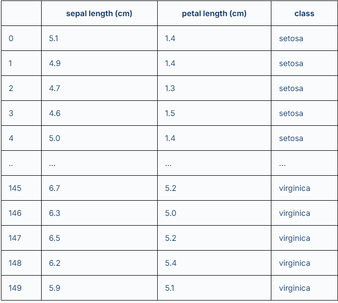
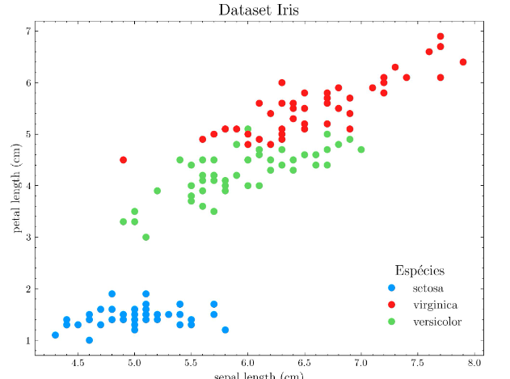

# [Data Visualization: conhecendo as bibliotecas do Python](https://www.alura.com.br/artigos/data-visualization-conhecendo-bibliotecas-python)
A Ciência de Dados é o conjunto de técnicas que trabalha em analisar e interpretar informações úteis e valiosas por trás de grandes volumes de dados que são gerados todos os dias, nos mais diferentes setores. Nesse contexto, surge também a visualização de dados que desempenha um papel importante quando precisamos identificar problemas, anomalias e tendências no processo de análise de dados. Logo, é uma ferramenta essencial para profissionais de dados e para o público em geral que consome essas informações.

Para resolver essas tarefas, surgem bibliotecas com o papel de unir a visualização de dados ao poder do Python e suas bibliotecas para Data Science, como [NumPy](https://www.alura.com.br/artigos/numpy-computacao-cientifica-com-python) e [Pandas](https://www.alura.com.br/artigos/pandas-o-que-e-para-que-serve-como-instalar), que já atuam em toda a cadeia do trabalho de extração, limpeza e transformação de dados.

Nesse artigo, vamos conhecer um pouco mais sobre a visualização de dados e algumas bibliotecas muito utilizadas.

## O que é Visualização de Dados (DataViz)?
A visualização de dados, também conhecida por termos como *data visualization* ou *DataViz*, é o conjunto de técnicas para representar informações e dados de forma visual de maneira compreensível a fim transmitir resultados de análise de dados. Essas técnicas são utilizadas para transformar grandes conjuntos de dados e registros em gráficos, tabelas e diagramas que podem ser processados mais facilmente e por qualquer pessoa.

Por exemplo, utilizando um conjunto de dados (*dataset*) como o Iris, que possui 150 registros com o comprimento (*length*) de sépalas e pétalas de algumas espécies de flores Iris, nós podemos apresentar as informações contidas nesse conjunto de algumas maneiras. Neste caso, podemos expor a tabela de dados diretamente:

Ou através do uso de gráficos, resumindo as informações desse conjunto de dados de maneira visual. O exemplo abaixo é um gráfico de dispersão (scatter) que traz os mesmos registros da tabela completa anterior:

Dessa maneira, nós conseguimos gerar insights de forma mais rápida e com uma linguagem simples. Para analisar o gráfico acima, não é preciso muito conhecimento técnico para compreender as características individuais de cada espécie de Iris, os tamanhos mínimos e máximos ou qual espécie tem pétala ou sépala maior, por exemplo. Isso facilita o processo de observar e comunicar resultados em análise de dados.

Na Ciência de Dados, a visualização de dados tem o papel fundamental de **conectar** os setores de cada área do negócio. Os projetos são executados por pessoas analistas e cientistas de dados e passam por uma fase na qual a apresentação dos resultados é estruturada.

Nesse ponto, cria-se um **storytelling** (uma maneira de apresentar informação ao público alvo) e para dar suporte a esse processo criativo e analítico, os dados agora transformam-se em resultados por meio de indicadores ou [KPIs](https://www.alura.com.br/empresas/artigos/kpi), insights, números, gráficos, diagramas, entre outros.

Vamos ver algumas biblotecas:

### Matplotlib
A Matplotlib é uma das bibliotecas mais populares para visualização de dados em Python. Criada em 2003, pelo cientista da computação John D. Hunter, o projeto Matplotlib foi desenvolvido com o objetivo de promover um ambiente de criação de gráficos (plots) semelhantes ao do software MATLAB.

O projeto é de código aberto (open source) e possui uma variedade de gráficos, como: o de linhas, dispersão, histogramas, barras, e muito mais. Ele também permite um alto nível de personalização, desde o trabalho com as cores de cada elemento, fontes, escalas, entre outros. Para os gráficos em imagens, é possível trabalhar com vários tipos de saída, desde os mais comuns PNG, PDF, JPEG, SVG e EPS, sendo este último um formato bastante utilizado para artigos acadêmicos e técnicos.

A documentação do Matplotlib disponibiliza dois links interessantes: o Plot Types e o Examples.

- [Plot types](https://matplotlib.org/stable/plot_types/): página dedicada a mostrar os tipos de visualizações possíveis com Matplotlib.
- [Examples](https://matplotlib.org/stable/gallery/): página com exemplos diversos e junção de funções de criação e customização diferentes do matplotlib. 

### Seaborn
Em 2012, sob orientação do cientista de dados americano Michael Waskom, surge a Seaborn, uma biblioteca de código aberto baseada no Matplotlib. Ela propõe uma interface de alto nível para trabalhar com gráficos mais atrativos e com informações estatísticas, com a ideia principal que, segundo Waskom, “a Seaborn torna coisas difíceis em coisas muito fáceis de serem feitas”.

A biblioteca é geralmente utilizada em conjunto com outras bibliotecas de análise de dados, das quais tem uma ótima aderência entre os seus objetos, como NumPy e Pandas, nos quais é possível indicar de maneira simples as variáveis que estão sendo utilizadas e gerar rapidamente resultados.

A Seaborn também possui uma [galeria de imagens](https://seaborn.pydata.org/examples/index.html) dos gráficos feitos utilizando a biblioteca.

E uma das características mais importantes da Seaborn é a **facilidade em tratar informações estatísticas** do conjunto de dados durante o processo de plot dos gráficos.

### Plotly
A Plotly é uma biblioteca de código aberto para visualização de dados de forma interativa em Python e que possui suporte em outras linguagens de programação. Criada em 2012 pelos cientistas de dados Alex Johnson, Jack Parmer e Chris Parmer, a Plotly chegou ao cenário com o objetivo de preencher a lacuna na visualização de dados interativa.

A principal característica da Plotly é a capacidade de criar gráficos que podem ser manipulados em tempo real pelas pessoas usuárias, permitindo que a exploração dos dados seja dinâmica e imersiva. Na interface do gráfico, é possível usar ações como diminuir e aumentar o zoom, mudar a região de observação (pan), utilizar filtros de dados e também animações.

A Plotly funciona muito bem com várias plataformas usadas em Ciência de Dados e desenvolvimento de softwares, tais como: Jupyter Notebook, Dash (framework de dashboards web), aplicativos webs, Streamlit e possui a possibilidade de exportação de HTML para páginas web.

A galeria de gráficos da Plotly está disponível na página [Plotly Open Source Graphing Library for Python](https://plotly.com/python/)

## O que vem depois?
O trabalho com visualização de dados e criação de gráficos e figuras não para por aqui. Também podemos incorporar esses itens em relatórios estáticos (documentos, PDFs, etc.) ou em relatórios dinâmicos, como os relatórios e dashboards criados em [Power BI](https://www.alura.com.br/artigos/power-bi). Além disso, podemos utilizar esses itens em páginas web, complementando tecnologias como o Flask, Django e as tecnologias para webapps voltadas a dados já mencionadas, como o Dash e Streamlit.