# Dicas de como escolher o tipo de visualização de dados para sua análise

A **ciência de dados** envolve uma série de processos que conta com a coleta, a limpeza, a análise, a interpretação e a visualização de dados com o objetivo de tomar decisões embasadas e resolver problemas.

Como parte do processo, a **visualização de dados** tem um grande papel: transformar dados brutos em informação compreensível, simples e direta por meio de elementos visuais (linhas, barras, pontos, entre outros).

Neste artigo, vamos te apresentar as principais visualizações de dados utilizadas em ciência de dados, exemplificando casos onde elas podem ser aplicadas, o objetivo daquele tipo de visual e como elas podem te auxiliar na execução de seus projetos aí na sua empresa, estudos e portfólios.

***Mas como posso escolher o tipo de visualização mais adequado para o meu projeto e para o que quero representar?***

A escolha do tipo de gráfico adequado se conecta ao tipo de dados que possuímos, qual o objetivo que temos em relação ao uso desse recurso visual e qual a organização que desejamos para os nossos dados a fim de gerar informações relevantes e que possam auxiliar na tomada de decisões ou na geração de insights na leitura dos dados.

O foco é informar apenas o que é necessário, evitando a distorção das informações, a sobrecarga cognitiva - aquela sensação de visual muito poluído e com mais recursos que o necessário, ou levando a interpretação equivocada da análise.

Vamos observar uma série de visualizações diferentes, entender os seus objetivos separadamente e aprender algumas boas práticas na criação e exibição destas visualizações.

## Tipos de visualização de dados
Podemos observar logo abaixo, um fluxograma que apresenta um resumo de diversos tipos de gráficos que trazem como pergunta central “O que você gostaria de apresentar?”

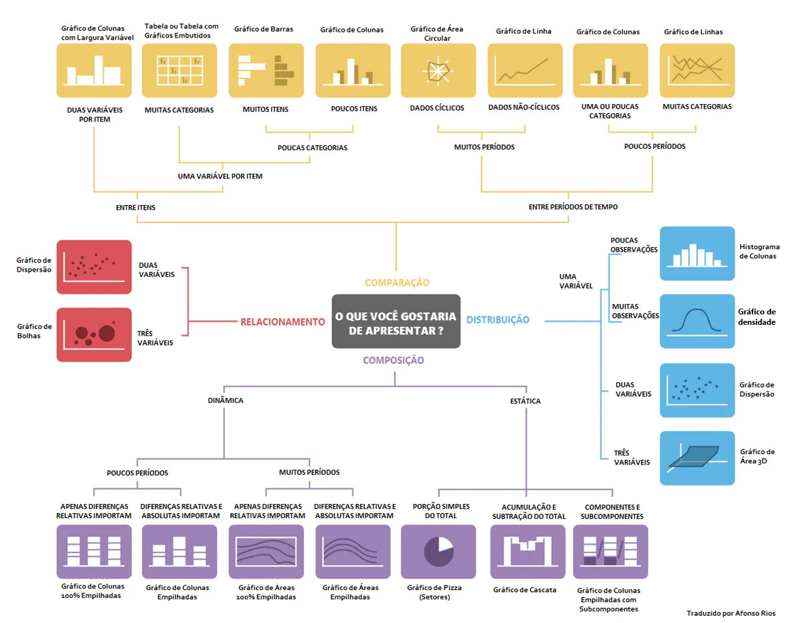

Note que, para cada objetivo, temos uma série de visuais que depende da variedade dos dados, se são dados numéricos, categóricos e temporais e até a quantidade de observações.

Vamos então explorar alguns gráficos de cada subgrupo: comparação, composição, distribuição e relacionamento.

### Comparação de dados
A comparação de dados se refere à análise e à interpretação de séries de dados identificando semelhanças, diferenças e padrões entre elas.

Podemos comparar diferentes valores e atributos buscando tendências, variações e relações entre os conjuntos de dados.

Os gráficos abaixo representam diversas formas de comparar dados, seja por valores numéricos, categoria e/ou tempo:

#### Gráfico de colunas
Um gráfico de colunas é uma representação visual de valores numéricos de uma ou mais categorias de dados, sejam elas discretas ou de intervalos definidos.

Ele é utilizado para comparar diferentes categorias ou grupos de dados por meio de barras verticais de forma rápida e direta.

É um dos gráficos mais utilizados na exploração dos dados, construção de relatórios e apresentações.

O gráfico de colunas abaixo representa a análise das vendas por departamento de um e-commerce fictício em um determinado período de tempo.

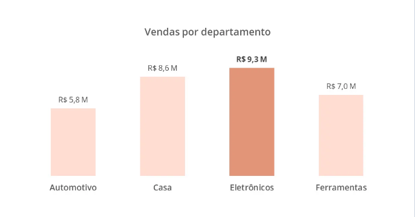

O gráfico construído destaca as vendas do departamento de Eletrônicos desta empresa. Além da comparação entre os dados ser bastante direta, seja pelo tamanho das colunas quanto a presença dos rótulos em milhões de reais, a utilização das cores facilita a distinção entre as barras, tornando esse visual fácil de ser lido e interpretado.

#### Gráfico de barras horizontais
Seguindo, temos outro visual bastante utilizado para comparação de dados que é o gráfico de barras horizontais.

Ele compara os dados de diferentes categorias ou grupos assim como o gráfico de colunas, porém enfatizando inicialmente as categorias.

Este visual é mais eficiente na leitura de rótulos e categorias mais longas, por trazer de maneira mais fluida (na horizontal) textos que possam ser extensos.

O destaque deste tipo de gráfico está primeiro na categoria dos dados e, em sequência, nos valores numéricos.

Abaixo, possuímos um gráfico de barras horizontais representando a população brasileira em 2022 dividida por região.

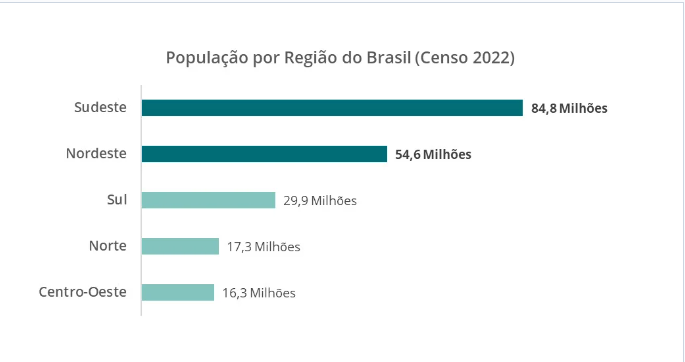

O gráfico construído destaca as populações da região Sudeste e Nordeste, ambas acima de 50 milhões de pessoas. Este visual em ciência de dados é muito utilizado para comparar categorias de uma ou mais variáveis por meio da contagem de vezes que aparecem tanto para pequenos quanto grandes conjuntos de dados, e para comunicar os resultados na análise exploratória dos dados. Uma boa prática de um gráfico de barras é manter as barras ordenadas de forma crescente ou decrescente, pois facilita a leitura desses dados.

#### Gráfico de linha
Outro visual largamente utilizado para comparação de dados são os gráficos de linha ou linhas.

Ele é um representação visual que conecta pontos de dados por meio de linhas retas, sendo ideal para representar as tendências ao longo do tempo, ou de acordo com uma sequência que possui ordenação.

Em ciência de dados, os gráficos de linha são frequentemente usados para visualizar séries temporais, como a evolução de vendas ao longo dos meses, como no gráfico abaixo, ou o crescimento de uma população ou amostra ao longo dos anos.

Quando possuímos uma grande quantidade de períodos em nossos dados, vale a pena recorrer a gráficos de linha(s) para representar as séries temporais.

No gráfico acima, destacamos os valores de abril e julho de 2023, por meio da mudança das cores dos pontos e a inserção dos rótulos com as vendas em milhares de reais.

Uma boa prática neste tipo de visual é a inserção de rótulos informativos em partes que desejamos destacar, a utilização de grades para facilitar a leitura das coordenadas dos pontos e o cuidado na escala dos eixos evitando distorções na leitura dos dados.

Já, um gráfico de linhas adiciona mais uma camada às análises, por meio da inserção de uma variável categórica, permitindo a comparação das séries temporais.

No exemplo abaixo, observamos o faturamento trimestral por empresa de atacado em uma cidade fictícia.

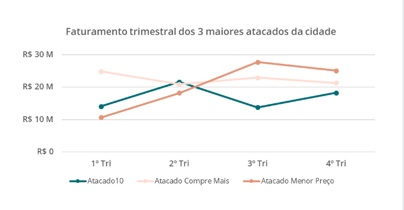

Com este visual, é possível comparar os faturamentos de cada atacado em diferentes momentos utilizando apenas um visual.

Tenha cautela na inserção de rótulos neste tipo de visual, evitando um excesso de elementos visuais no gráfico.

Outra boa prática é adicionar o menor número de linhas possível para não poluir visualmente o gráfico, perdendo o seu sentido prático.

Gráficos de linha, em geral, são ótimos para destacar padrões, identificar tendências e obter insights em ciência de dados.

#### Gráfico de barras/colunas agrupadas
Como último visual que vamos explorar neste artigo em comparação de dados, existe uma outra forma de combinar gráficos de barras e colunas, que são as barras/colunas agrupadas.

Eles são uma representação visual que organiza barras ou colunas em grupos, em que cada grupo representa uma categoria ou variável e as barras dentro de cada grupo representam uma subcategoria ou subconjunto de dados.

Um gráfico de colunas ou barras agrupadas é ideal quando desejamos comparar diferentes categorias em relação a uma variável, mostrando como os valores se comparam dentro de cada categoria (no gráfico abaixo, os anos) em colunas separadas (no gráfico abaixo, “Nosso site”, “Concorrente A” e “Concorrente B”), facilitando a visualização de padrões e diferenças entre grupos.

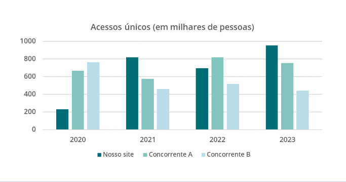

O gráfico construído apresenta a evolução dos acessos únicos na categoria “Nosso site” e compara com os acessos de dois dos concorrentes no mesmo visual.

Em ciência de dados, esse tipo de gráfico é útil para comparar métricas ou características de diferentes categorias em uma única visualização, por exemplo, o desempenho de diferentes produtos em várias regiões geográficas ao longo do tempo.

Uma boa prática para um gráfico de colunas e/ou barras agrupadas é usar cores distintas para cada grupo facilitando a diferenciação entre eles, organizar as colunas sempre na mesma sequência em cada uma das categorias ou períodos e evitar o uso demasiado de rótulos dos dados.

### Composição de dados
Vamos para o nosso 2º subgrupo de visualização de dados que é a composição de dados. Ela, na visualização de dados, refere-se à representação de conjuntos de dados como partes de um todo, destacando a contribuição de diferentes componentes para a totalidade dos dados.

Em ciência de dados, a composição de dados é frequentemente utilizada para analisar as características gerais de categorias ou subgrupos dentro de um conjunto de dados, visualizando a sua estrutura e como os diferentes componentes se relacionam entre si e com o todo.

Os gráficos abaixo representam diversas formas de compor dados, seja de maneira estática, com um período fixo, ou dinâmica, ao longo do tempo:

#### Gráfico de Pizza
Um gráfico de pizza é uma representação visual que utiliza um círculo dividido em fatias para retratar as proporções de diferentes categorias dentro de um conjunto de dados.

Ele serve para destacar a composição de partes em relação ao todo, especialmente quando se deseja enfatizar a participação percentual de cada categoria. É um dos gráficos mais utilizados no dia a dia, porém precisa-se de muita atenção ao construí-lo.

Em ciência de dados, o gráfico de pizza é frequentemente utilizado para visualizar a composição estática de dados, como a composição das receitas por categoria de produtos ou a participação de uma categoria em relação a todas as outras, bem como comunicar resultados com poucas categorias.

O gráfico abaixo representa o resultado de uma pesquisa acerca da percepção dos usuários na atualização da interface de um site.

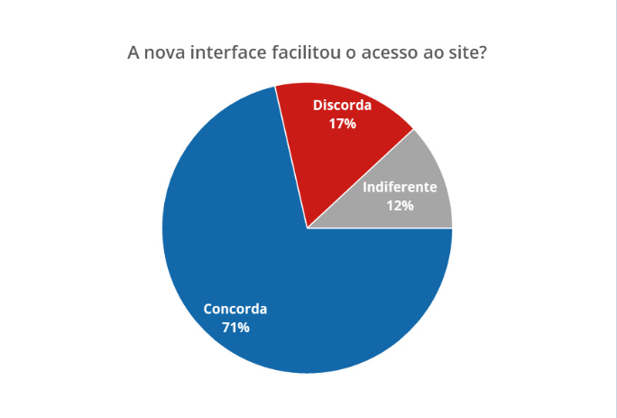

O gráfico construído demonstra em valores percentuais as respostas dos usuários à nova interface do site.

É preciso bastante cuidado em sua utilização, evitando mais de 5 fatias (categorias) e também o uso de fatias muito próximas (por exemplo 51% e 49%) ou muito distantes entre si (por exemplo, 99% e 1%).

Além disso, os gráficos de pizza são melhor aproveitados em dados dicotômicos (2 categorias).

#### Gráfico de barras empilhadas
Vamos para mais outro gráfico de composição de dados que é o gráfico de barras empilhadas.

Ele é uma representação visual que mostra a composição de diferentes categorias ao longo de uma variável independente, como o tempo, empilhando as barras umas sobre as outras representando a totalidade dos dados.

Um gráfico de barras ou colunas empilhadas é ideal quando desejamos adicionar à comparação entre períodos ou categorias a comparação também entre os dados de cada período/categoria.

Assim, conseguimos representar a contribuição de cada categoria para o todo e as mudanças na composição ao longo do tempo ou de acordo com uma variável específica.

No gráfico abaixo, notamos a composição da Receita Bruta de Vendas de uma empresa que é dada pela soma entre a Receita Operacional Líquida (ROL), os impostos, as devoluções de produtos e os descontos.

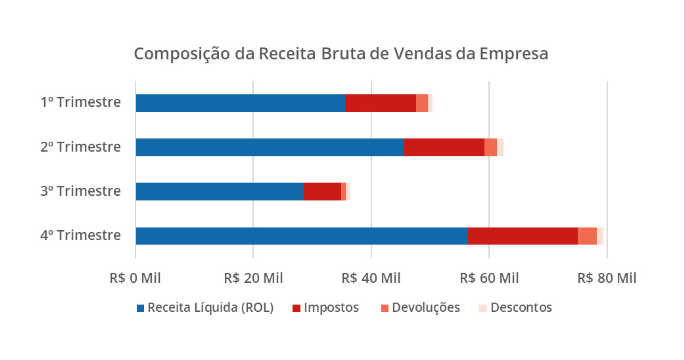

Note que o gráfico construído, mostra a evolução da Receita Bruta de Vendas ao longo dos trimestres e também a composição de cada parcela dos valores que constituem ela para cada trimestre.

Em ciência de dados, os gráficos de barras empilhadas são frequentemente utilizados para comparar a distribuição de dados categóricos em diferentes grupos ou períodos.

Uma boa prática para um gráfico de barras empilhadas é usar o mínimo de categorias possível para evitar uma poluição visual e adicionar rótulos apenas em pontos específicos que se deseja certo destaque.

#### Gráfico de áreas empilhadas
Semelhante a um gráfico de barras empilhadas, o gráfico de áreas empilhadas também é uma representação visual que mostra a evolução da contribuição de diferentes categorias ao longo de um período de tempo ou em relação a uma variável independente.

A diferença está na possibilidade de adicionar mais períodos de tempo na análise sem inserir uma série de barras.

Aqui, um gráfico de áreas empilhadas combina as características de um gráfico de linhas, sendo empilhadas e com as áreas abaixo delas preenchidas, como podemos observar no gráfico abaixo representado o consumo de energia de uma localidade por fonte renovável em valores percentuais.

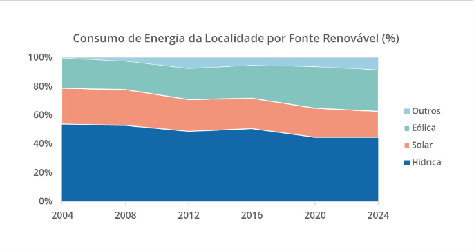

Neste visual podemos perceber claramente a evolução no consumo de energia eólica e a redução tanto da energia de fonte hídrica quanto solar.

É possível criar esse tipo de gráfico tanto empilhado com valores absolutos quanto em valores percentuais, dependendo do que você deseja representar: a comparação entre períodos com a evolução dos valores ao longo do tempo ou a composição percentual ao longo do tempo.

### Distribuição de dados
Agora, vamos para o 3º subgrupo de visualização de dados, que é a distribuição de dados.

Ela se refere à representação da frequência ou probabilidade de ocorrência de diferentes valores em um conjunto de dados.

Conseguimos por meio dos seus visuais entender como as observações individuais são distribuídas dentro do nosso conjunto de dados, identificando os seus padrões, tendências e características importantes dos dados.

Em ciência de dados, a distribuição de dados é fundamental para entender a natureza dos dados, analisando se a distribuição de variáveis segue um padrão e se há valores extremos que precisam ser investigados.

Além disso, a distribuição de dados é frequentemente usada na modelagem estatística e análise preditiva para ajustar modelos aos dados e fazer previsões.

Os gráficos abaixo representam diversas formas de distribuir os dados ajudando às pessoas cientistas de dados a entender a variabilidade dos dados, identificar outliers (valores atípicos) e tomar decisões embasadas nos padrões observados:

#### Histograma
Um histograma é uma representação visual que mostra a distribuição dos dados em um dado intervalo.

Ele divide os dados em intervalos, chamados de “bins”, que apresentam quantas observações estão presentes naquela faixa de dados.

Os histogramas também auxiliam na identificação de tendências centrais, variabilidade e simetria dos dados e possíveis outliers.

Em ciência de dados, os histogramas são amplamente utilizados para explorar a distribuição de variáveis ​​numéricas, como idade, renda, temperatura, entre outras.

No gráfico abaixo, representamos o número de clientes por faixa etária

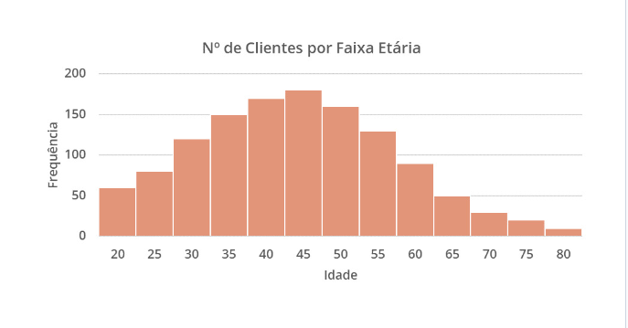

No gráfico construído, percebemos uma maior concentração de clientes entre 35 e 50 anos (mais de 150 pessoas por faixa).

Uma boa prática para um histograma é o equilíbrio entre o número apropriado de “bins” e a largura dos “bins” para representação dos dados, sem que sejam intervalos muito pequenos (bins estreitos que podem gerar ruídos por poucas observações em determinados intervalos) ou muito grandes (bins largos que podem descaracterizar a curva e reduzir a sensibilidade na variação das faixas).

#### Gráfico de densidade
Um gráfico de densidade é uma representação visual da distribuição da probabilidade de uma variável contínua.

Ele apresenta a densidade de probabilidade pelo eixo horizontal, em que a área total sob a curva é igual a 1.

O gráfico de densidade ajuda a visualizar a forma e a suavidade na distribuição dos dados e identificar picos, assimetrias e caudas.

Em ciência de dados, os gráficos de densidade são frequentemente utilizados para visualizar a distribuição de variáveis numéricas e comparar a distribuição de diferentes grupos ou categorias.

No gráfico abaixo, representamos a distribuição de salários de uma localidade partindo de 2.000 reais até 16.000 reais.

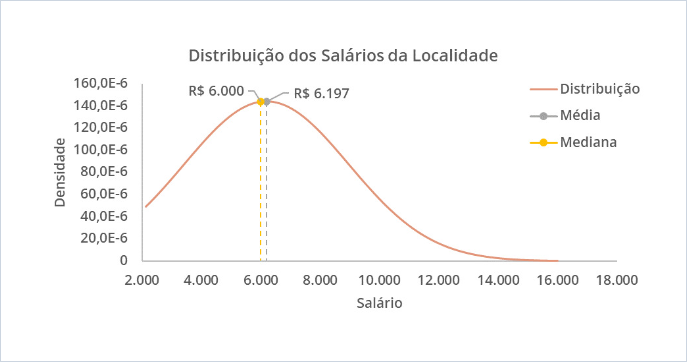

No gráfico construído, percebemos uma maior concentração dos salários mais à esquerda do gráfico e com a média e mediana dos salários em 6.197 e 6.000 reais, respectivamente.

Uma boa prática para o gráfico de densidade é escolher uma suavização adequada para a curva de densidade, ajustar a largura da banda de suavização para capturar variações adequadas nos dados e fornecer uma legenda que consegue distinguir os dados.

#### Boxplot e Violinplot
Um boxplot é uma representação visual que apresenta a distribuição de um conjunto de dados por meio de uma série de estatísticas descritivas: quartis, mediana, mínimo, máximo e outliers.

Ele auxilia na visualização da dispersão e centralidade dos dados, identificando assimetrias, outliers e variações nos dados.

Já o violinplot é uma versão mais detalhada do boxplot que exibe não somente os quartis, mas também a distribuição dos dados por meio da representação da forma e suavidade da distribuição.

Em ciência de dados, ambos são utilizados para visualizar a distribuição de variáveis numéricas e comparar distribuições entre diferentes grupos ou categorias.

No gráfico abaixo, podemos notar as semelhanças e diferenças entre o boxplot e o violinplot na distribuição das avaliações de um dado produto.

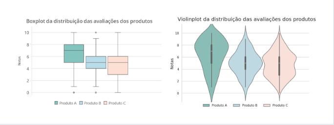

Note que, no gráfico à esquerda, podemos observar alguns elementos de cada produto: limite inferior e limite superior antes dos outliers (traços horizontais que delimitam as linhas fora das caixas), 1º, 2º e 3º quartil (limite inferior, traço interno, limite superior da caixa, respectivamente) e pontos fora dos limites (outliers).

No gráfico à direita, podemos notar pequenos boxplots representados dentro das curvas que representam a distribuição das avaliações.

Podemos observar que o gráfico à esquerda se concentra nos valores das estatísticas descritivas e o gráfico à direita na curva de densidade da distribuição.

### Relacionamento de dados
Vamos então para o 4º e último subgrupo de visualização de dados deste artigo, que é o relacionamento de dados.

Ele se refere à representação visual das relações entre diferentes variáveis em um conjunto de dados.

Podendo abranger as correlações, associações ou dependências entre as variáveis através da utilização de visuais deste tipo.

Em ciência de dados, entender o relacionamento entre variáveis é muito importante na identificação de padrões, tendências e insights importantes nos dados.

Essas visualizações ajudam as pessoas cientistas de dados a explorar como as variáveis estão interconectadas e como elas afetam umas às outras.

Além disso, as análises de relacionamento de dados são essenciais para modelagem preditiva, segmentação de mercado, identificação de influenciadores e tomada de decisões embasadas em dados.

Os gráficos abaixo representam algumas das formas de relacionar os dados ajudando às pessoas cientistas de dados a investigar a relação e a intensidade de relação entre os dados e como eles podem afetar no seu projeto:

#### Gráfico de dispersão
Um gráfico de dispersão é uma representação visual que apresenta a relação ou distribuição entre duas variáveis numéricas num conjunto de dados.

Cada ponto no gráfico representa a combinação entre as coordenadas das duas variáveis, que também chamamos de observação.

Ele é utilizado largamente em ciência de dados, pois é uma visualização que auxilia na identificação de associações ou padrões, tendências e correlações entre as variáveis que são de extrema importância para o aprendizado de máquina (ML).

O gráfico abaixo ilustra um exemplo em que utilizamos um gráfico de dispersão para visualizar a relação entre o tempo de entrega de um produto à satisfação do cliente na avaliação da entrega.

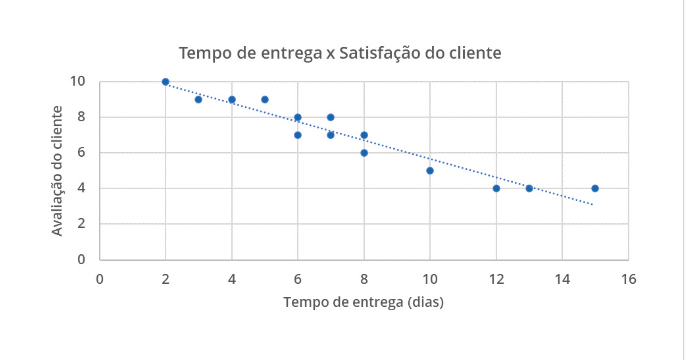

No gráfico construído, percebemos uma tendência inversamente proporcional (negativa) entre o tempo de entrega e avaliação: quanto maior o tempo de entrega a tendência é de uma menor avaliação.

É importante inferir que isso não significa que uma variável causa efeito na outra, mas apenas que existe uma relação e qual a intensidade entre essa relação.

Uma boa prática para o gráfico de dispersão é a escolha adequada das escalas dos eixos e destaques em pontos ou regiões de importância em sua análise.

Além disso, é importante também verificar a presença de outliers e avaliar a natureza da relação entre as variáveis antes de fazer conclusões.

#### Matriz de correlação
O nosso último visual é a matriz de correlação dos dados. Ela é uma representação visual semelhante a uma tabela que mostra a correlação entre variáveis numéricas ou categóricas nominais em um conjunto de dados.

A matriz apresenta os coeficientes de correlação entre todas as combinações de variáveis, variando de -1 a 1, onde -1 indica uma correlação negativa perfeita, 1 indica uma correlação positiva perfeita e 0 indica ausência de correlação.

Esta escala serve para identificar padrões de associação entre variáveis, ajudando a entender como elas se relacionam entre si.

Ela é bastante utilizada em modelos de aprendizado de máquina em ciência de dados explorando a relação entre variáveis e identificando quais variáveis têm maior influência umas sobre as outras.

A matriz de correlação pode ser útil na análise exploratória e na seleção de variáveis para modelagem preditiva.

No gráfico abaixo representamos uma matriz de correlação para 4 variáveis:

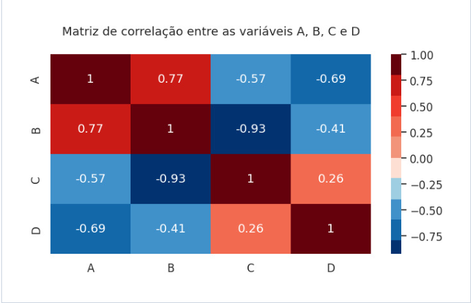

O visual construído demonstra os coeficientes da correlação entre os dados como, por exemplo, uma correlação fortemente negativa entre as variáveis B e C.

Como boas práticas deste visual é importante escolher o método adequado para o cálculo de correlação, dependendo da natureza dos dados, entender o contexto para interpretar as relações e o uso de mapas de calor, como no gráfico acima, para interpretar mais rapidamente os resultados da matriz.

## Conclusão
Você percebeu, portanto, que falamos aqui sobre uma série de visuais partindo de gráficos voltados à comparação, composição, distribuição e relacionamento dos dados.

Vimos o que cada subgrupo representa, quais visuais são os mais adequados para o meu objetivo de análise ou apresentação de resultados e algumas boas práticas ao longo do caminho.

Mas recomendo que você não pare por aqui e aproveite para estudar com a gente a formação de [Data Science](https://www.alura.com.br/formacao-data-science), com o nosso time de especialistas que vai te ajudar a alavancar sua carreira e capacitar você a tomar as melhores decisões por quais gráficos representar seus projetos, ideias e dados.

Compartilhe também este artigo com suas amizades, colegas e pessoas que possam se interessar pelo assunto.